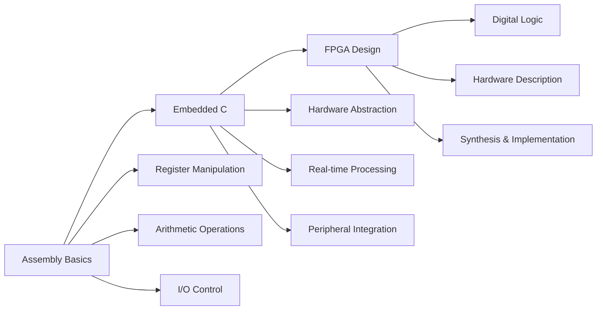

# 🚀 Embedded Systems & FPGA Portfolio

> **Professional embedded systems portfolio showcasing progression from assembly language fundamentals to advanced microcontroller programming and FPGA digital design**

   
   

---

## 🎯 **Skills Demonstrated**

### **� Programming Languages**

- **Assembly Language** - ATmega128 (AVR) low-level programming
- **Embedded C** - PIC24FJ128GA705 real-time applications
- **VHDL** - FPGA digital logic design

### **🔧 Hardware Platforms**

- **ATmega128** - 8-bit AVR microcontroller
- **PIC24FJ128GA705** - 16-bit microcontroller with advanced peripherals
- **Digilent Arty Z7-10** - Zynq-7000 FPGA development board

### **⚡ Technical Expertise**

- **Low-level Programming** - Direct register manipulation, bit operations
- **Real-time Systems** - Hardware timers, interrupt handling, ADC processing
- **Digital Logic Design** - Combinational logic, FPGA synthesis
- **Mixed-language Development** - C/Assembly integration
- **Professional Documentation** - Comprehensive technical writing

### **�️ Development Tools**

- **MPLAB X IDE** - Microchip development environment
- **XC8/XC16 Compilers** - Optimized embedded C compilation
- **Xilinx Vivado** - FPGA synthesis and implementation
- **Microchip Code Configurator (MCC)** - Hardware abstraction layer generation

---

## 📋 **Project Overview** | 🔰 **Beginner** → 🟡 **Intermediate** → 🔴 **Advanced**

| Project                       | Difficulty   | Platform        | Key Skills                                          | Demo                                    |
| ----------------------------- | ------------ | --------------- | --------------------------------------------------- | --------------------------------------- |
| **🔰 Assembly Fundamentals**  | Beginner     | ATmega128       | Register operations, arithmetic, I/O control        | [📁 Details](MPLABXProjects/Project1.X) |
| **🟡 Embedded C Programming** | Intermediate | PIC24FJ128GA705 | ADC, timers, GPIO, interrupts, data structures      | [📁 Details](MPLABXProjects/test1.X)    |
| **🔴 FPGA Digital Logic**     | Advanced     | Arty Z7-10      | VHDL, synthesis, logic design, hardware description | [📁 Details](zaj1_18.10.2024)           |

---

## 🎓 **Learning Progression Path**

---

## 🎯 **Quick Navigation**

### **🔰 Start Here: Assembly Language Foundation**

� [`MPLABXProjects/Project1.X`](MPLABXProjects/Project1.X)

- **What you'll see:** Direct CPU instruction programming, register manipulation
- **Key files:** `addition.s`, `subtraction.s`, `blink.s`, `diode.s`
- **Skills shown:** Low-level programming, bit operations, conditional logic

### **🟡 Advanced Embedded: Real Microcontroller Application**

📁 [`MPLABXProjects/test1.X`](MPLABXProjects/test1.X)

- **What you'll see:** Professional embedded C with hardware peripherals
- **Key files:** `main.c` (learning process), `main_clean.c` (production code)
- **Skills shown:** ADC processing, timer interrupts, GPIO control, data structures

### **🔴 FPGA Digital Design: Hardware Logic Implementation**

📁 [`zaj1_18.10.2024`](zaj1_18.10.2024)

- **What you'll see:** Digital logic circuits described in VHDL
- **Key files:** `led1.vhd`, `led2.vhd`, `switch.vhd`
- **Skills shown:** Hardware description languages, logic synthesis, FPGA development

---

## � **Professional Highlights**

### **📈 Code Quality Evolution**

This portfolio demonstrates professional development practices:

- **Learning Documentation** - Authentic university code showing the learning process
- **Code Refactoring** - Clean, documented versions for production use
- **Technical Writing** - Comprehensive documentation and educational materials

### **🔧 Industry-Ready Skills**

- **Multi-platform Development** - Three different hardware architectures
- **Professional Tool Usage** - Industry-standard development environments
- **Hardware Integration** - Real-world embedded systems experience
- **Documentation Excellence** - Technical writing suitable for team collaboration

---

## 🎯 **Technologies Mastered**

| Category        | Technologies                                           | Proficiency Level |
| --------------- | ------------------------------------------------------ | ----------------- |
| **Programming** | Assembly (AVR), Embedded C, VHDL                       | ⭐⭐⭐⭐⭐        |
| **Hardware**    | ATmega128, PIC24FJ128GA705, Zynq-7000 FPGA             | ⭐⭐⭐⭐⭐        |
| **Tools**       | MPLAB X, Vivado, XC8/XC16, MCC, Git                    | ⭐⭐⭐⭐⭐        |
| **Concepts**    | Real-time systems, Digital logic, Hardware abstraction | ⭐⭐⭐⭐⭐        |

---

## 🚀 **Getting Started**

### **👁️ Quick Preview (No Setup Required)**

1. **Browse Projects** - Each folder has clear documentation
2. **View Code** - All source files are well-commented
3. **Check Demos** - GIFs show actual hardware running

### **🔧 For Developers (Setup Required)**

1. **Clone Repository**: `git clone https://github.com/JackobPunch/MicrocontrollerAndFPGAbasics.git`
2. **Choose Your Path**:
   - **Assembly Learning**: Open `MPLABXProjects/Project1.X` in MPLAB X
   - **Embedded C**: Open `MPLABXProjects/test1.X` in MPLAB X
   - **FPGA Design**: Open `zaj1_18.10.2024.xpr` in Vivado

### **📚 Recommended Learning Order**

1. **Start** with Assembly fundamentals (`Project1.X`)
2. **Progress** to Embedded C applications (`test1.X`)
3. **Advance** to FPGA digital design (`zaj1_18.10.2024`)

---

## 📞 **Contact & Collaboration**

**Interested in embedded systems development or have questions about these projects?**

- 📧 **Professional Inquiries**: [Create an issue](https://github.com/JackobPunch/MicrocontrollerAndFPGAbasics/issues)
- 🤝 **Collaboration**: Open to embedded systems projects and technical discussions
- 📚 **Education**: Happy to help fellow students with embedded programming concepts

---

## 📄 **License & Usage**

This portfolio is primarily educational. Feel free to:

- ✅ **Study** the code and documentation
- ✅ **Reference** techniques in your own projects
- ✅ **Learn** from the progression and documentation style
- ✅ **Ask questions** through GitHub issues

---

**🎯 This portfolio demonstrates progression from fundamental assembly programming to advanced embedded systems development**

_Built with passion for embedded systems and hardware programming_ 🚀

