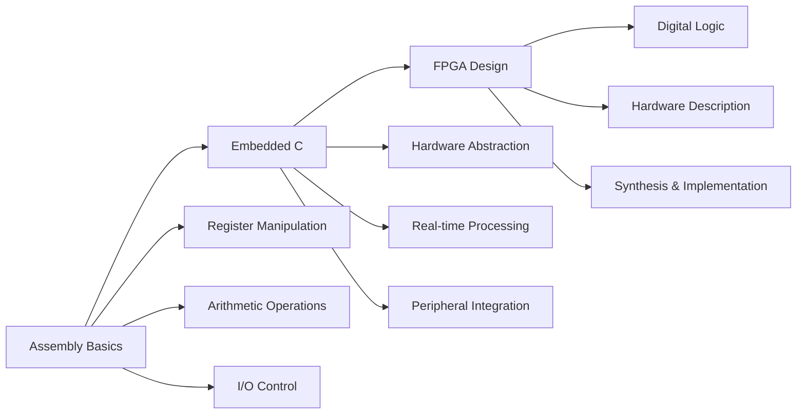

# 🎓 University Embedded Systems Learning Journey

> **Collection of university coursework exploring embedded systems fundamentals - from assembly language basics to microcontroller programming and FPGA digital design**

   
   

---

## 📚 **What I Learned During University**

### **💻 Programming Languages Explored**

- **Assembly Language** - Basic ATmega128 programming during introductory coursework
- **Embedded C** - PIC24FJ128GA705 applications with university guidance
- **VHDL** - Introduction to FPGA digital logic concepts

### **🔧 Hardware Platforms Used in Class**

- **ATmega128** - 8-bit microcontroller for assembly learning exercises
- **PIC24FJ128GA705** - 16-bit microcontroller for C programming practice
- **Digilent Arty Z7-10** - FPGA board for basic digital logic experiments

### **🎓 Concepts Practiced**

- **Low-level Programming** - Learning register manipulation and bit operations
- **Basic Embedded Systems** - Simple timers, GPIO, and ADC usage
- **Digital Logic Basics** - Combinational circuits in VHDL
- **Development Process** - Using industry tools under instructor guidance
- **Documentation** - Learning to organize and explain technical work

### **🛠️ Development Tools Learned**

- **MPLAB X IDE** - Introduction to Microchip development environment
- **XC8/XC16 Compilers** - Basic embedded C compilation
- **Xilinx Vivado** - Introduction to FPGA development workflow
- **Microchip Code Configurator (MCC)** - Hardware configuration tool basics

---

## 📋 **University Coursework Projects**

| Project                | Course Level | Platform        | What I Practiced                                    | Details                                   |
| ---------------------- | ------------ | --------------- | --------------------------------------------------- | ----------------------------------------- |
| **🔰 Assembly Basics** | Introductory | ATmega128       | Register operations, simple arithmetic, basic I/O   | [📁 View Code](MPLABXProjects/Project1.X) |
| **🟡 Embedded C**      | Intermediate | PIC24FJ128GA705 | GPIO control, timers, ADC reading, basic structures | [📁 View Code](MPLABXProjects/test1.X)    |
| **🔴 FPGA Logic**      | Advanced     | Arty Z7-10      | Simple VHDL circuits, basic synthesis concepts      | [📁 View Code](zaj1_18.10.2024)           |

---

## 🎓 **Learning Progression Path**

---

## 📂 **Project Navigation**

### **🔰 Assembly Language Exercises**

📁 [`MPLABXProjects/Project1.X`](MPLABXProjects/Project1.X)

- **What's inside:** Basic assembly language exercises from introductory course
- **Key files:** `addition.s`, `subtraction.s`, `blink.s`, `diode.s`
- **What I learned:** Register usage, simple arithmetic, basic I/O operations

### **🟡 Embedded C Practice**

📁 [`MPLABXProjects/test1.X`](MPLABXProjects/test1.X)

- **What's inside:** University exercises in embedded C programming
- **Key files:** `main.c` (original learning code), `main_clean.c` (organized later)
- **What I practiced:** GPIO control, timers, ADC reading, basic data structures

### **🔴 FPGA Introduction**

📁 [`zaj1_18.10.2024`](zaj1_18.10.2024)

- **What's inside:** Simple digital logic circuits as FPGA introduction
- **Key files:** `led1.vhd`, `led2.vhd`, `switch.vhd`
- **What I explored:** Basic VHDL syntax, simple logic gates, Vivado workflow

---

## 📖 **Learning Journey**

### **� How This Repository Evolved**

This collection represents my learning progression through university embedded systems courses:

- **Original Code** - Authentic learning process with experiments and iterations
- **Later Organization** - Cleaned up and documented for better understanding
- **Documentation Practice** - Learning to explain technical concepts clearly

### **🎓 Academic Experience Gained**

- **Multiple Platforms** - Exposure to different microcontroller families
- **Tool Familiarity** - Hands-on experience with industry development environments
- **Hardware Interaction** - Working with real embedded systems hardware
- **Project Organization** - Learning to structure and document technical work

---

## 📊 **Technologies Explored**

| Category        | Technologies                                 | Learning Level        |
| --------------- | -------------------------------------------- | --------------------- |
| **Programming** | Assembly (AVR), Embedded C, VHDL             | University coursework |
| **Hardware**    | ATmega128, PIC24FJ128GA705, Zynq-7000 FPGA   | Hands-on lab work     |
| **Tools**       | MPLAB X, Vivado, XC8/XC16, MCC, Git          | Practical experience  |
| **Concepts**    | Basic embedded systems, Simple digital logic | Introductory level    |

---

## 🚀 **Getting Started**

### **👁️ Quick Preview (No Setup Required)**

1. **Browse Projects** - Each folder has clear documentation
2. **View Code** - All source files are well-commented
3. **Check Demos** - GIFs show actual hardware running

### **🔧 For Developers (Setup Required)**

1. **Clone Repository**: `git clone https://github.com/JackobPunch/MicrocontrollerAndFPGAbasics.git`
2. **Choose Your Path**:
   - **Assembly Learning**: Open `MPLABXProjects/Project1.X` in MPLAB X
   - **Embedded C**: Open `MPLABXProjects/test1.X` in MPLAB X
   - **FPGA Design**: Open `zaj1_18.10.2024.xpr` in Vivado

### **📚 Recommended Learning Order**

1. **Start** with Assembly fundamentals (`Project1.X`)
2. **Progress** to Embedded C applications (`test1.X`)
3. **Advance** to FPGA digital design (`zaj1_18.10.2024`)

---

## � **Questions & Discussion**

**Have questions about the code or embedded systems learning?**

- 📧 **Questions**: [Create an issue](https://github.com/JackobPunch/MicrocontrollerAndFPGAbasics/issues) if anything needs clarification
- 🎓 **Learning**: Happy to discuss embedded programming concepts with fellow students
- 🤝 **Feedback**: Always open to suggestions for improving documentation or code organization

---

## 📄 **Usage & Learning**

This repository contains university coursework and is shared for educational purposes. Feel free to:

- ✅ **Study** the code and learning progression
- ✅ **Use** as reference for your own embedded systems learning
- ✅ **Learn** from both the messy and clean code versions
- ✅ **Ask questions** if you're working on similar coursework

---

**� University coursework documenting my journey learning embedded systems fundamentals**

_Learning embedded systems through hands-on university coursework_ �

